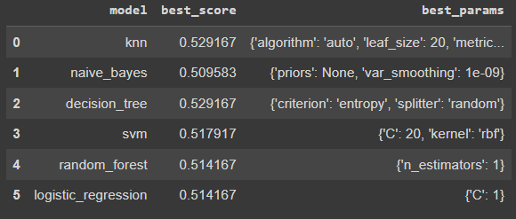
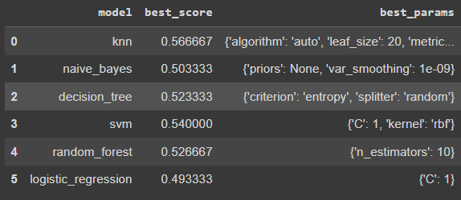

# Lung_Cancer_Prediction
 This project demonstrates the use of hyperparameter tuning with the GridSearchCV technique from the scikit-learn library. Hyperparameter tuning is essential for optimizing the performance of machine learning models by finding the best combination of hyperparameters.

 ##Here are the results on the training dataset:
 
 

 ##here are the result on testing dataset:
  
 
